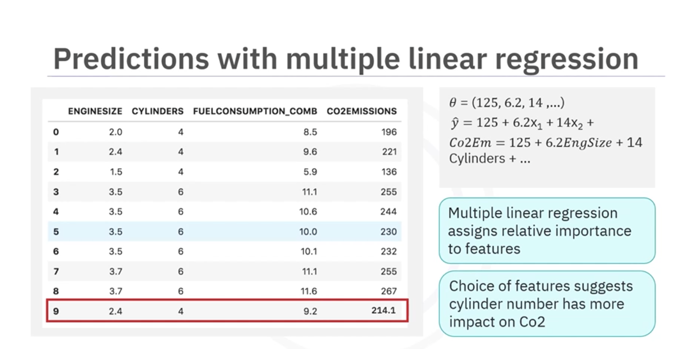

## Summary of Multiple Linear Regression

### Definition and Fundamentals

**Multiple linear regression** is an extension of simple linear regression that uses **two or more independent variables** to estimate a dependent variable, rather than just one. It creates a linear combination of features to produce predictions.

### Mathematical Model

The multiple linear regression equation is expressed as:

$$
\hat{y} = \theta_0 + \theta_1 x_1 + \theta_2 x_2 + \theta_3 x_3 + ... + \theta_n x_n
$$

Where:
- $$\hat{y}$$ is the predicted output
- $$\theta_0$$ is the intercept (bias term)
- $$\theta_1, \theta_2, ..., \theta_n$$ are the weights (coefficients) for each feature
- $$x_1, x_2, ..., x_n$$ are the independent variables

In matrix form, the features can be represented as matrix **X** and the weights as vector **θ**.

### Geometric Interpretation

Unlike simple linear regression (which defines a line) or multiple linear regression with two features (which defines a plane), models with more than two features describe a **hyperplane** in multi-dimensional space.

### Practical Example

Using a car dataset with engine size, number of cylinders, and fuel consumption as features to predict CO2 emissions:

For a car with engine size 2.4L and 4 cylinders:
$$
\text{CO2 emission} = 125 + 6.2(2.4) + 14(4) + ... = 214.1
$$

Each coefficient represents the **relative importance** of that feature in predicting the outcome.

### Model Optimization

**Mean Squared Error (MSE)** measures prediction error by calculating the average of all residual errors (actual value minus predicted value). For example, if the true value is 196 but the model predicts 140, the residual error is 56.

Two common methods to minimize MSE and find optimal coefficients are:

**Ordinary Least Squares (OLS)** – Uses linear algebra operations on matrix data to directly calculate the best parameter values.

**Gradient Descent** – An iterative optimization approach that starts with random coefficient values and progressively minimizes error. This method works particularly well with large datasets.

### Advantages Over Simple Regression

Multiple linear regression produces better predictions than simple regression by incorporating multiple predictors and measuring the strength of each variable's effect on the dependent variable.

### Handling Categorical Variables

To incorporate categorical variables into the model, they must be converted to numerical form:

**Binary variables** – Assign 0 for one category and 1 for another (e.g., 0 for manual transmission, 1 for automatic).

**Multi-class variables** – Transform into multiple Boolean features, one for each class.

### Common Pitfalls and Solutions

**Overfitting** – Adding too many variables can cause the model to memorize training data rather than learn generalizable patterns, resulting in poor predictions on new data.

**Multicollinearity (Collinearity)** – When two or more independent variables are correlated with each other, they are no longer truly independent, as they predict each other. This creates problems, especially in "what-if" scenarios where changing one correlated variable should logically change another.

**Solution:** Remove redundant correlated variables using a balanced approach, retaining variables that are uncorrelated, well-understood, controllable, and most strongly correlated with the target variable.

### What-If Scenarios

Multiple linear regression enables **hypothetical predictions** by changing input features to see predicted outcomes. For example, determining how a patient's blood pressure changes with variations in body mass index (BMI).

**Limitations of What-If Analysis:**
- Impossible or unrealistic scenarios may be considered
- Extrapolation too far beyond the training data can lead to inaccurate predictions
- When variables are correlated, changing one variable while holding others constant becomes infeasible in reality

### Real-World Applications

Multiple linear regression is widely used across industries:

- **Education:** Predicting student exam performance from revision time, test anxiety, lecture attendance, and gender
- **Healthcare:** Analyzing relationships between health variables and outcomes
- **Business and Economics:** Forecasting sales, costs, and revenue using multiple predictors
- **Any field requiring multivariate analysis** where understanding the combined effect of multiple factors is important